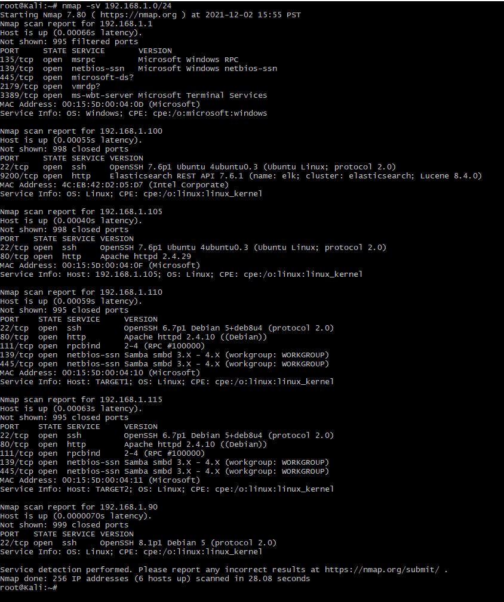

# Blue Team: Summary of Operations

## Table of Contents
- Network Topology
- Description of Targets
- Monitoring the Targets
- Patterns of Traffic & Behavior
- Suggestions for Going Further

### Network Topology

The following machines were identified on the network (Refer to the screenshot below the table to see the output of the network scan command):

| Name  	| Operating System  	| Purpose  	| IP Address   	|
|---	|---	|---	|---	|
| ELK  	| Linux   	| ELK Server to gather, analyze and perform an elastic search of the logs from target machines.   	| 192.168.1.100  	|
| Capstone  	| Linux  	| Vulnerable machine to test and perform different attacks.  	| 192.168.1.105  	|
| Target 1  	| Linux   	| Vulnerable machine with an installation of WordPress. Machine on which attacks need to be performed in order to extract information.  	| 192.168.1.110  	|
| Target 2  	| Linux  	| Vulnerable machine with an installation of WordPress. Machine on which attacks need to be performed in order to extract information.  	| 192.168.1.115  	|

#### Screenshot

The following screenshot depicts the result of the network scan using the command `nmap -sV 192.168.1.0/24`. This command scans the entire range of IP addresses as indicated:

### Description of Targets
_TODO: Answer the questions below._

The target of this attack was: `Target 1` (TODO: IP Address).

Target 1 is an Apache web server and has SSH enabled, so ports 80 and 22 are possible ports of entry for attackers. As such, the following alerts have been implemented:

### Monitoring the Targets

Traffic to these services should be carefully monitored. To this end, we have implemented the alerts below:

#### Name of Alert 1
_TODO: Replace `Alert 1` with the name of the alert._

Alert 1 is implemented as follows:
  - **Metric**: TODO
  - **Threshold**: TODO
  - **Vulnerability Mitigated**: TODO
  - **Reliability**: TODO: Does this alert generate lots of false positives/false negatives? Rate as low, medium, or high reliability.

#### Name of Alert 2
Alert 2 is implemented as follows:
  - **Metric**: TODO
  - **Threshold**: TODO
  - **Vulnerability Mitigated**: TODO
  - **Reliability**: TODO: Does this alert generate lots of false positives/false negatives? Rate as low, medium, or high reliability.

#### Name of Alert 3
Alert 3 is implemented as follows:
  - **Metric**: TODO
  - **Threshold**: TODO
  - **Vulnerability Mitigated**: TODO
  - **Reliability**: TODO: Does this alert generate lots of false positives/false negatives? Rate as low, medium, or high reliability.

_TODO Note: Explain at least 3 alerts. Add more if time allows._

### Suggestions for Going Further (Optional)
_TODO_: 
- Each alert above pertains to a specific vulnerability/exploit. Recall that alerts only detect malicious behavior, but do not stop it. For each vulnerability/exploit identified by the alerts above, suggest a patch. E.g., implementing a blocklist is an effective tactic against brute-force attacks. It is not necessary to explain _how_ to implement each patch.

The logs and alerts generated during the assessment suggest that this network is susceptible to several active threats, identified by the alerts above. In addition to watching for occurrences of such threats, the network should be hardened against them. The Blue Team suggests that IT implement the fixes below to protect the network:
- Vulnerability 1
  - **Patch**: TODO: E.g., _install `special-security-package` with `apt-get`_
  - **Why It Works**: TODO: E.g., _`special-security-package` scans the system for viruses every day_
- Vulnerability 2
  - **Patch**: TODO: E.g., _install `special-security-package` with `apt-get`_
  - **Why It Works**: TODO: E.g., _`special-security-package` scans the system for viruses every day_
- Vulnerability 3
  - **Patch**: TODO: E.g., _install `special-security-package` with `apt-get`_
  - **Why It Works**: TODO: E.g., _`special-security-package` scans the system for viruses every day_