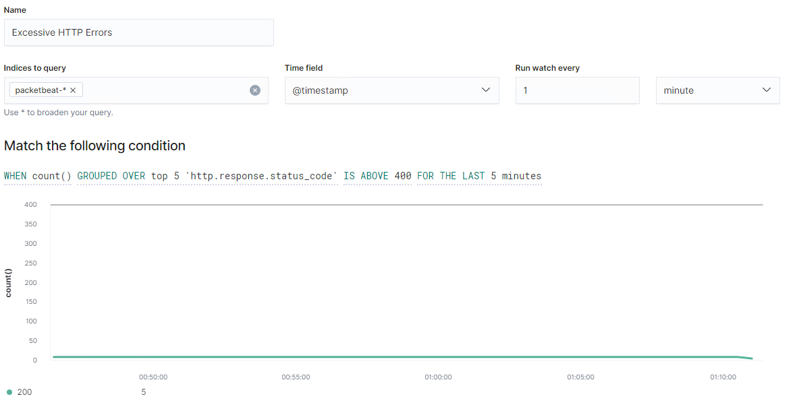
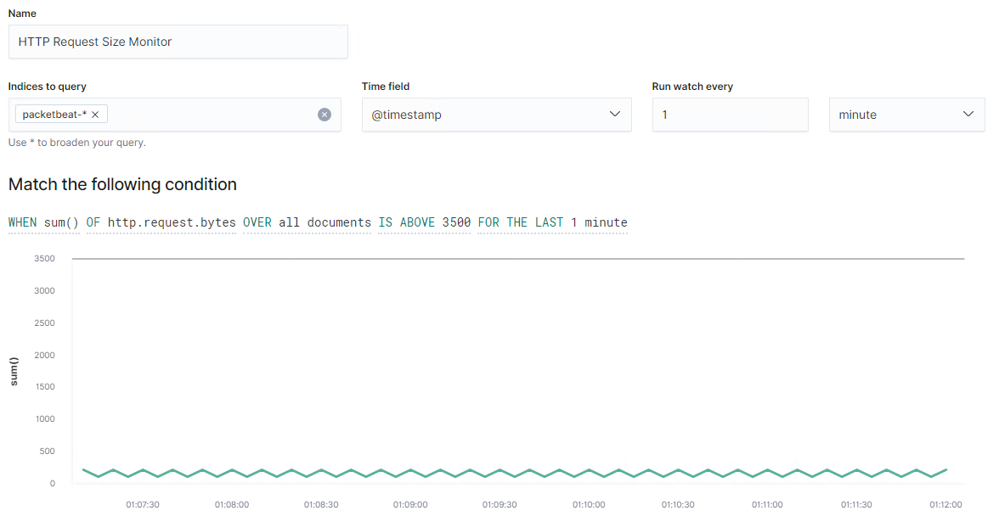

# Blue Team: Summary of Operations

## Table of Contents
- Network Topology
- Description of Targets
- Monitoring the Targets
- Patterns of Traffic & Behavior
- Suggestions for Going Further

### Network Topology

The following machines were identified on the network (Refer to the screenshot below the table to see the output of the network scan command):

| Name  	| Operating System  	| Purpose  	| IP Address   	|
|---	|---	|---	|---	|
| ELK  	| Linux   	| ELK Server to gather, analyze and perform an elastic search of the logs from target machines.   	| 192.168.1.100  	|
| Capstone  	| Linux  	| Vulnerable machine to test and perform different attacks.  	| 192.168.1.105  	|
| Target 1  	| Linux   	| Vulnerable machine with an installation of WordPress. Machine on which attacks need to be performed in order to extract information.  	| 192.168.1.110  	|
| Target 2  	| Linux  	| Vulnerable machine with an installation of WordPress. Machine on which attacks need to be performed in order to extract information.  	| 192.168.1.115  	|

#### Screenshot

The following screenshot depicts the result of the network scan using the command `nmap -sV 192.168.1.0/24`. This command scans the entire range of IP addresses as indicated:

### Description of Targets

The target of this attack was: `Target 1: 192.168.1.110`

Target 1 is an Apache web server and has SSH enabled, so ports 80 and 22 are possible ports of entry for attackers. As such, the following alerts have been implemented:

* HTTP errors
* HTTP request size
* CPU Usage

### Monitoring the Targets

Traffic to these services should be carefully monitored. To this end, we have implemented the alerts below:

#### Excessive HTTP Errors

This alert is implemented as follows:
  - **Metric**: Alert when the 5 most common http responses are above the threshold in the las 5 minutes.
  - **Threshold**: 400 (to account for all the http error responses)
  - **Vulnerability Mitigated**: DDoS
  - **Reliability**: High
 

#### HTTP Request Size Monitor
This alert is implemented as follows:
  - **Metric**: Alert when the total size of all the request packets are above the threshold in the last minute.
  - **Threshold**: 3500
  - **Vulnerability Mitigated**: DDoS
  - **Reliability**: Medium

#### CPU Usage Monitor
This alert is implemented as follows:
  - **Metric**: Alert when the percentage of total CPU usage is above the threshold in the last 5 minutes.
  - **Threshold**: 0.5
  - **Vulnerability Mitigated**: Malware
  - **Reliability**: Low

